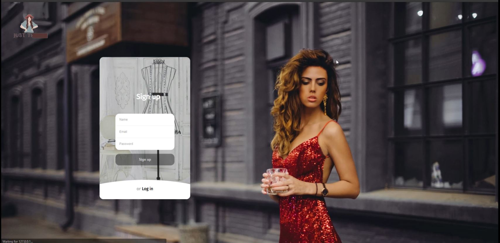
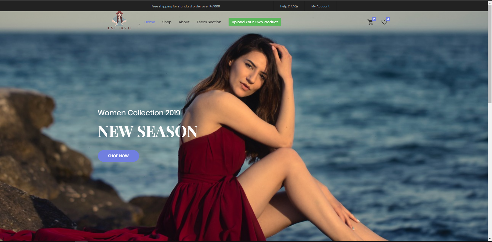
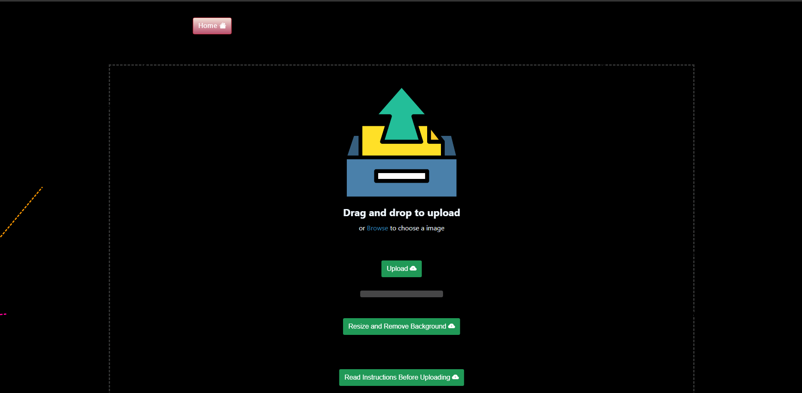
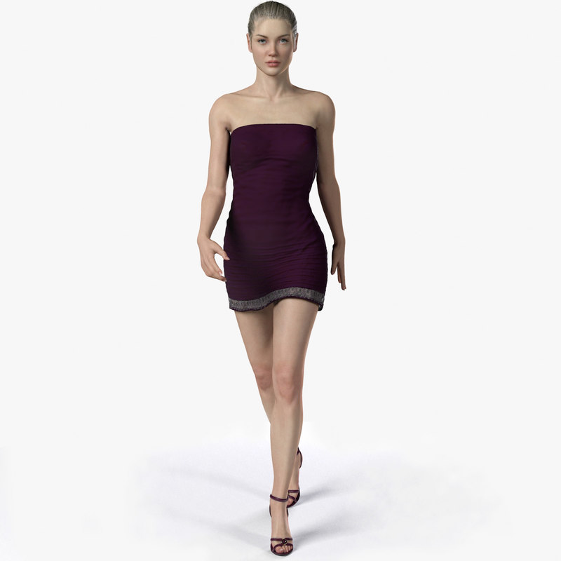

# JustTryIt
The search is over. We present to you ‘Just Try It’’ where you can select any apparel,any accessory and put it on yourself to see how it looks! Decide after trying so you get only what you really want.


## Requirements
Python 3.8 or above with all [requirements](requirements.txt) dependencies installed. To install run:
```python
$ pip install -r requirements.txt
```

## Our Inspirarion
The whole revolution that this pandemic brought upon our lives has only sped up the process of every business going online. In such times, where e-commerce and e-shopping sites were already booming, having no choice but take to online shops has somewhere changed the user experience dynamics. Decision making is tougher in certain areas,  a major one being fashion.<br>
Choosing apparels and accessories by looking at them on models only pose a limited imagination, and thus the whole tedious process ordering and returning becomes a task in itself for both customers and brands. Hence, we thought of bringing the experience of offline shopping to the customers at home by using virtual reality and AI.


## Other Features
1. **Accessories Try On**-<br>
             - Other than Tops and Frocks you can even try on Tiaras/Hats and Goggles too.<br>
1. **Jewellry Try On**-<br>
             - We have implemented Jewellry and Earrings Try On too.<br>


## How to Run :
1. Test your Camera before heading towards main website. Run **Camera.py** file and test your Camera.
2. Now you can the main Website by heading toward **main.py** file. Simply run the file in any Code Editor (VS Code, Py Charm, etc..)

```python
$ python main.py
```
3. Chnage the code of **self.video = cv2.VideoCapture(1)** to **self.video = cv2.VideoCapture(0)**, if you want to use PC webcam, we have used Mobile Camera as Canera because of High Quality Cameras.<br>
   Software Used to Connect Phone Camera to PC : DroidCam (available on Play Store and https://www.dev47apps.com/droidcam/windows/)
     
     
 ## Login
 
 
  ## Home Page
 
 
  ## Upload your Own Product Image
 
 
 
 ## Models we used for Testing, you can try it on your own too just pan the camera towards you :
 
 ## Accessories Model
 
 
 
 ## Frocks Model
 
 
 
 ## Tops Model
 
 
